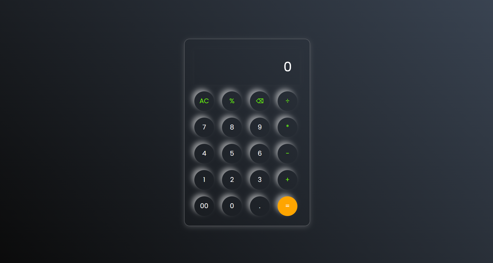

# 🧮 Calculator Web App

A simple and responsive calculator built using **HTML, CSS, and JavaScript**. This project performs basic arithmetic operations with a clean UI and smooth functionality.

---

## 🚀 Features

- ➕ Addition, ➖ Subtraction, ✖️ Multiplication, ➗ Division  
- 🧹 Clear button (AC)  
- ⌫ Backspace functionality  
- 📊 Real-time display update  
- 🔒 Input validation (only numbers and operators allowed)  
- 📱 Responsive design

---

## 📸 Preview

---

## 🛠️ Tech Stack

- HTML5  
- CSS3  
- JavaScript (Vanilla JS)  

---

## 🎯 How It Works

- User clicks buttons to input numbers and operators  
- JavaScript handles events using `addEventListener`  
- Expression is evaluated using `eval()`  
- Result is displayed instantly on screen  

---

## 📂 Project Structure
calculator/
│── index.html
│── style.css
│── script.js

---

## ⚠️ Note

- This project uses `eval()` for calculation, which works fine for learning purposes but is **not recommended for production apps** due to security reasons.

---

## 💡 Future Improvements

- Add keyboard support  
- Add scientific calculator functions  
- Improve UI animations  
- Replace `eval()` with a safer logic  

---

## 👨‍💻 Author

**Lokpal Singh Solanki (Lucky)**  

---

## ⭐ Support

If you like this project, give it a ⭐ on GitHub!
